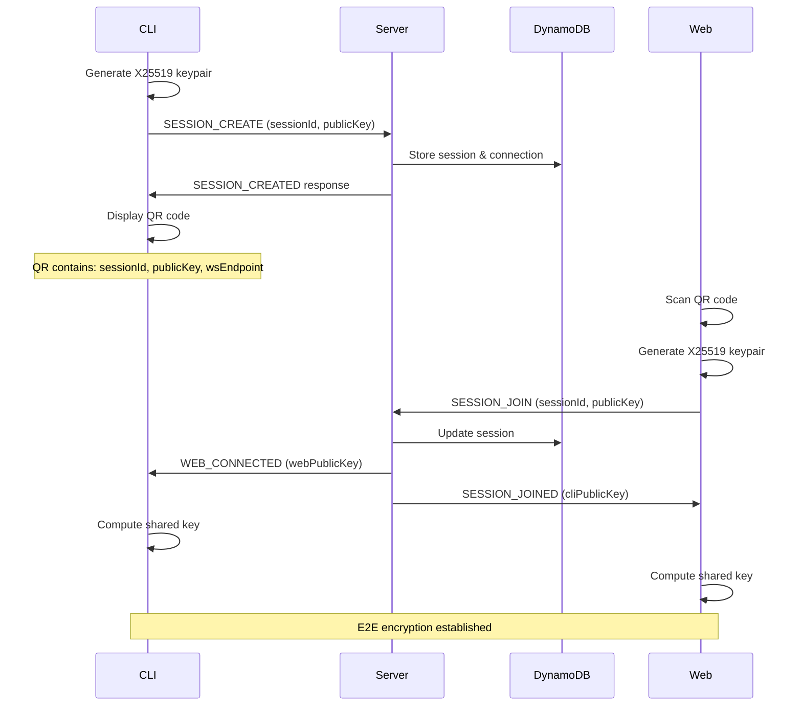
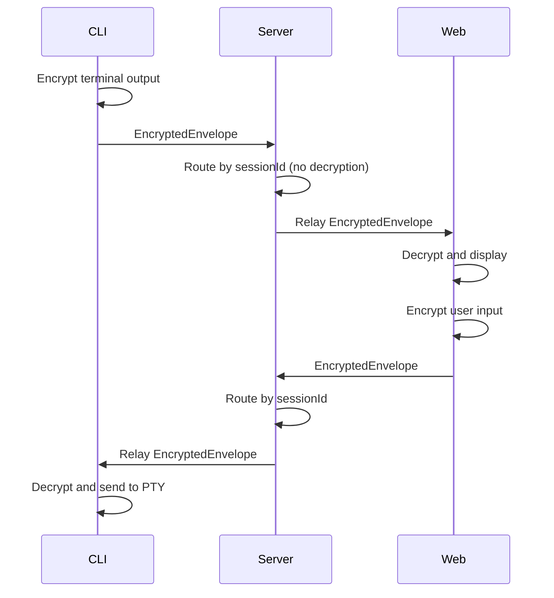
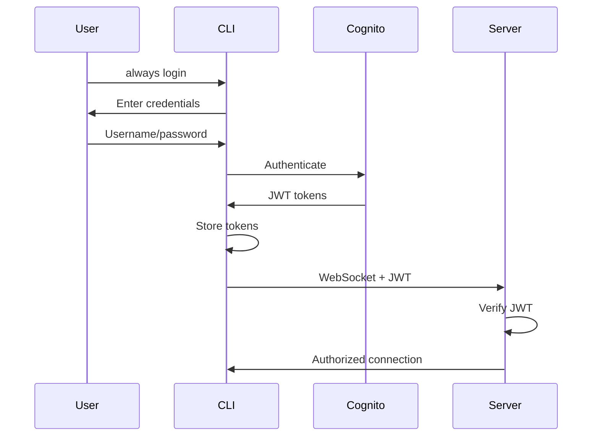

# Always Coder - System Architecture

## Overview

Always Coder is a distributed system enabling secure remote access to AI coding assistants through end-to-end encrypted WebSocket connections. The architecture follows a zero-knowledge design where the server never has access to decrypted data.

## System Components

### 1. CLI Client (`packages/cli`)

The CLI client is a Node.js application that wraps AI assistant processes and manages the local terminal session.

**Key Responsibilities:**
- Process management via node-pty
- WebSocket connection to server
- E2E encryption key generation
- QR code generation for pairing
- Session lifecycle management
- Daemon mode for background operation
- Cognito authentication

**Core Modules:**
```
cli/src/
├── auth/cognito.ts       # AWS Cognito authentication
├── config/index.ts       # Configuration management
├── crypto/encryption.ts  # Encryption manager
├── daemon/index.ts       # Background process management
├── pty/terminal.ts       # PTY process wrapper
├── qrcode/generator.ts   # QR code display
├── session/
│   ├── manager.ts        # Session orchestration
│   └── remote.ts         # Remote session discovery
└── websocket/client.ts   # WebSocket connection
```

### 2. Server (`packages/server`)

AWS Lambda functions handling WebSocket connections and message routing without decryption.

**Key Responsibilities:**
- WebSocket connection management
- Encrypted message relay
- Session state management
- User authentication via Cognito
- Connection persistence in DynamoDB

**Lambda Functions:**
```
server/src/
├── handlers/
│   ├── connect.ts        # $connect route handler
│   ├── disconnect.ts     # $disconnect route handler
│   ├── message.ts        # $default route handler
│   └── authorizer.ts     # Custom authorizer
├── services/
│   ├── connection.ts     # Connection management
│   ├── relay.ts          # Message relay logic
│   └── session.ts        # Session management
└── edge/
    ├── auth.ts           # Lambda@Edge authentication
    ├── callback.ts       # OAuth callback handler
    └── index.ts          # Request router
```

### 3. Web Client (`packages/web`)

Next.js 14 application providing browser-based terminal access.

**Key Responsibilities:**
- QR code scanning for session joining
- Terminal emulation via xterm.js
- E2E encryption in browser
- WebSocket connection management
- Cognito authentication UI

**Component Structure:**
```
web/src/
├── app/                  # Next.js App Router
│   ├── page.tsx         # Home page
│   ├── session/[id]/    # Session terminal page
│   └── layout.tsx       # Root layout
├── components/
│   ├── Terminal/        # xterm.js wrapper
│   ├── QRScanner/       # QR code scanner
│   └── Auth/            # Authentication UI
├── hooks/
│   ├── useWebSocket.ts  # WebSocket connection
│   ├── useCrypto.ts     # Encryption hook
│   └── useSession.ts    # Session management
└── lib/
    ├── websocket.ts     # WebSocket client
    └── crypto.ts        # Browser crypto
```

### 4. Shared Library (`packages/shared`)

Common types, protocols, and cryptographic implementations.

**Core Modules:**
```
shared/src/
├── crypto/
│   └── nacl.ts          # TweetNaCl E2E encryption
├── protocol/
│   └── messages.ts      # Message type definitions
└── types/
    ├── message.ts       # Message interfaces
    └── session.ts       # Session types
```

### 5. Infrastructure (`infra`)

AWS CDK infrastructure as code for deploying all cloud resources.

**Stack Components:**
```
infra/lib/
├── api-stack.ts         # API Gateway, Lambda, DynamoDB
└── web-stack.ts         # CloudFront, S3, Lambda@Edge
```

## Data Flow

### Session Creation Flow



### Message Relay Flow



## Encryption Architecture

### Key Exchange (X25519)

1. **CLI generates ephemeral keypair** - Fresh keypair per session
2. **Web generates ephemeral keypair** - On QR scan
3. **Diffie-Hellman key agreement** - Both compute same shared secret
4. **Perfect forward secrecy** - Keys destroyed after session

### Message Encryption (XSalsa20-Poly1305)

```typescript
interface EncryptedEnvelope {
  version: 1;
  sessionId: string;
  nonce: string;        // 24 bytes, base64
  ciphertext: string;   // Encrypted Message, base64
  timestamp: number;
}

interface Message<T> {
  type: MessageType;
  payload: T;
  seq: number;          // Sequence number
}
```

**Encryption Process:**
1. Serialize message to JSON
2. Generate random 24-byte nonce
3. Encrypt with XSalsa20-Poly1305 using shared key
4. Create envelope with metadata
5. Send over WebSocket

**Security Properties:**
- **Confidentiality** - XSalsa20 stream cipher
- **Integrity** - Poly1305 MAC
- **Authenticity** - Only holder of private key can decrypt
- **Replay protection** - Random nonce per message

## AWS Infrastructure

### API Gateway WebSocket

- **Protocol**: WebSocket (wss://)
- **Routes**:
  - `$connect` - New connection handler
  - `$disconnect` - Connection cleanup
  - `$default` - Message routing
- **Authorizer**: Optional Cognito verification

### Lambda Functions

| Function | Trigger | Purpose | Timeout |
|----------|---------|---------|---------|
| Connect | $connect | Register connection | 30s |
| Disconnect | $disconnect | Cleanup connection | 30s |
| Message | $default | Route messages | 30s |
| Authorizer | Custom | Verify JWT tokens | 10s |
| Edge Auth | CloudFront | Authenticate web access | 5s |

### DynamoDB Tables

**Connections Table:**
```typescript
{
  connectionId: string;  // Partition key
  sessionId: string;     // GSI
  role: 'cli' | 'web';
  publicKey: string;
  userId?: string;
  createdAt: number;
  ttl: number;          // 24 hours
}
```

**Sessions Table:**
```typescript
{
  sessionId: string;     // Partition key
  userId?: string;       // GSI
  status: 'active' | 'inactive';
  cliConnectionId?: string;
  webConnectionIds: string[];
  instanceId?: string;
  instanceLabel?: string;
  hostname?: string;
  command?: string;
  createdAt: number;
  lastActiveAt: number;
  ttl: number;          // 24 hours
}
```

**Messages Table:**
```typescript
{
  sessionId: string;     // Partition key
  timestamp: number;     // Sort key
  envelope: EncryptedEnvelope;
  ttl: number;          // 1 hour
}
```

### CloudFront + S3

- **Distribution**: HTTPS-only CDN
- **Origin**: Private S3 bucket
- **Lambda@Edge**: Authentication at edge locations
- **Caching**: Static assets cached globally

## Authentication Flow

### Cognito Integration (Optional)



### Lambda@Edge Authentication

```mermaid
sequenceDiagram
    participant Browser
    participant CloudFront
    participant Lambda@Edge
    participant Cognito
    participant S3

    Browser->>CloudFront: Request page
    CloudFront->>Lambda@Edge: Trigger
    Lambda@Edge->>Lambda@Edge: Check cookie

    alt No valid session
        Lambda@Edge->>Browser: Redirect to login
        Browser->>Cognito: OAuth flow
        Cognito->>Browser: Redirect + code
        Browser->>Lambda@Edge: Callback + code
        Lambda@Edge->>Cognito: Exchange code
        Cognito->>Lambda@Edge: Tokens
        Lambda@Edge->>Browser: Set cookie + redirect
    end

    Lambda@Edge->>CloudFront: Continue
    CloudFront->>S3: Fetch content
    S3->>Browser: Return page
```

## Multi-Instance Session Management

### Session Discovery

CLI instances can discover and reconnect to existing sessions:

```typescript
// CLI broadcasts instance info
interface SessionUpdatePayload {
  instanceId: string;      // Unique per machine
  instanceLabel: string;   // User-friendly name
  hostname: string;        // Machine hostname
  command: string;         // Running command
  commandArgs: string[];   // Command arguments
}

// Server maintains session registry
interface RemoteSessionInfo {
  sessionId: string;
  status: 'active' | 'inactive';
  instanceId?: string;
  instanceLabel?: string;
  hostname?: string;
  command?: string;
  createdAt: number;
  lastActiveAt: number;
}
```

### Reconnection Flow

1. **CLI starts** - Check for existing sessions
2. **Query server** - `SESSION_LIST_REQUEST`
3. **Server responds** - List of user's sessions
4. **CLI reconnects** - `SESSION_RECONNECT` with new keys
5. **Resume session** - Continue with new encryption

## Scaling Considerations

### Current Limitations

- **WebSocket connections**: 500 concurrent (API Gateway limit)
- **Message size**: 32KB (API Gateway limit)
- **Lambda concurrency**: 1000 (default limit)
- **DynamoDB**: On-demand scaling

### Scaling Strategies

1. **Horizontal scaling** - Multiple API Gateway deployments
2. **Regional distribution** - Deploy to multiple AWS regions
3. **Connection pooling** - Reuse WebSocket connections
4. **Message batching** - Combine small messages
5. **CDN optimization** - CloudFront for global distribution

## Security Model

### Threat Model

**Protected Against:**
- Network eavesdropping (E2E encryption)
- Server compromise (zero-knowledge)
- Message tampering (authenticated encryption)
- Replay attacks (nonce-based)
- Session hijacking (ephemeral keys)

**Assumptions:**
- Endpoints are secure (CLI and browser)
- QR code channel is trusted
- TweetNaCl implementation is correct

### Defense in Depth

1. **Transport Security** - TLS/WSS for all connections
2. **Application Encryption** - E2E encryption layer
3. **Authentication** - Optional Cognito integration
4. **Authorization** - User-scoped sessions
5. **Audit Logging** - CloudWatch logs
6. **Automatic Expiry** - 24-hour TTL on all data

## Monitoring & Observability

### CloudWatch Metrics

- Lambda invocations and errors
- API Gateway connection count
- DynamoDB read/write capacity
- CloudFront cache hit ratio

### CloudWatch Logs

- Lambda function logs
- API Gateway access logs
- DynamoDB operation logs

### Alarms

- High error rate
- Throttling events
- Connection limit approaching
- DynamoDB capacity exceeded

## Disaster Recovery

### Backup Strategy

- **DynamoDB**: Point-in-time recovery enabled
- **S3**: Versioning enabled
- **Code**: Git repository
- **Infrastructure**: CDK templates in source control

### Recovery Procedures

1. **Service outage** - Redeploy CDK stacks
2. **Data loss** - Restore from DynamoDB backups
3. **Region failure** - Deploy to alternate region
4. **Corruption** - Sessions expire in 24 hours

## Performance Optimization

### Latency Reduction

- **CloudFront CDN** - Global edge locations
- **Lambda@Edge** - Authentication at edge
- **DynamoDB Global Tables** - Multi-region replication
- **Connection reuse** - Keep WebSockets alive

### Throughput Optimization

- **Message batching** - Combine terminal updates
- **Compression** - Future: compress before encryption
- **Binary protocol** - Future: replace JSON with MessagePack
- **Worker threads** - Parallel encryption/decryption

## Future Enhancements

### Planned Features

1. **Multi-party sessions** - Multiple web clients per session
2. **Session recording** - Encrypted session playback
3. **File transfer** - Secure file upload/download
4. **Audio/video** - WebRTC integration
5. **Collaborative editing** - Shared cursor/selection

### Architecture Evolution

1. **Microservices** - Split monolithic Lambda functions
2. **Event sourcing** - Command/event pattern
3. **CQRS** - Separate read/write paths
4. **GraphQL** - Replace REST with GraphQL
5. **Kubernetes** - Container orchestration option