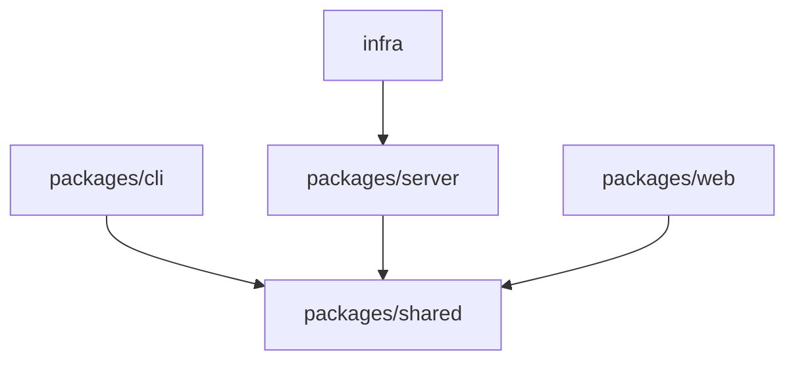

# Always Coder - Development Guide

## Overview

This guide covers development setup, coding standards, testing practices, and contribution guidelines for the Always Coder project.

## Table of Contents

1. [Development Environment](#development-environment)
2. [Project Setup](#project-setup)
3. [Architecture Overview](#architecture-overview)
4. [Development Workflow](#development-workflow)
5. [Testing](#testing)
6. [Code Standards](#code-standards)
7. [Debugging](#debugging)
8. [Contributing](#contributing)
9. [Release Process](#release-process)

## Development Environment

### Prerequisites

| Tool | Version | Purpose |
|------|---------|---------|
| **Node.js** | 20+ | Runtime environment |
| **pnpm** | 8.14+ | Package manager |
| **Git** | 2.x | Version control |
| **VS Code** | Latest | Recommended IDE |
| **AWS CLI** | 2.x | AWS deployment |
| **Docker** | Optional | Local testing |

### Recommended VS Code Extensions

```json
{
  "recommendations": [
    "dbaeumer.vscode-eslint",
    "esbenp.prettier-vscode",
    "ms-vscode.vscode-typescript-next",
    "orta.vscode-jest",
    "streetsidesoftware.code-spell-checker",
    "eamodio.gitlens",
    "amazonwebservices.aws-toolkit-vscode",
    "humao.rest-client"
  ]
}
```

### Environment Setup

```bash
# Install Node.js 20+ using nvm
nvm install 20
nvm use 20

# Install pnpm globally
npm install -g pnpm

# Install AWS CDK CLI
npm install -g aws-cdk

# Configure git
git config --global user.name "Your Name"
git config --global user.email "your.email@example.com"
```

## Project Setup

### 1. Clone Repository

```bash
# Clone the repository
git clone https://github.com/tyyzqmf/always-coder.git
cd always-coder

# Create your feature branch
git checkout -b feature/your-feature-name
```

### 2. Install Dependencies

```bash
# Install all workspace dependencies
pnpm install

# Build all packages (respects dependency order)
pnpm build

# Verify installation
pnpm test
```

### 3. Local Configuration

Create `.env` file in project root:

```bash
# Development settings
NODE_ENV=development
DEBUG=always-coder:*

# AWS Configuration (for deployment)
AWS_PROFILE=always-coder-dev
CDK_DEFAULT_ACCOUNT=123456789012
CDK_DEFAULT_REGION=us-east-1

# Local development URLs
ALWAYS_CODER_SERVER=ws://localhost:8080
ALWAYS_CODER_WEB_URL=http://localhost:3000

# Optional: Cognito for testing auth
COGNITO_USER_POOL_ID=us-east-1_XXXXXXXXX
COGNITO_CLIENT_ID=1abc2def3ghi4jkl5mno6pqr
```

## Architecture Overview

### Monorepo Structure

```
always-coder/
├── packages/           # Workspace packages
│   ├── shared/        # Shared types and crypto (built first)
│   ├── cli/           # CLI application
│   ├── server/        # Lambda functions
│   └── web/           # Next.js web app
├── infra/             # AWS CDK infrastructure
├── docs/              # Documentation
└── scripts/           # Build and deployment scripts
```

### Package Dependencies



### Build Order

1. `@always-coder/shared` - Core types and crypto
2. `@always-coder/cli` - CLI application
3. `@always-coder/server` - Lambda handlers
4. `@always-coder/web` - Web application
5. `infra` - CDK deployment

## Development Workflow

### Running in Development Mode

```bash
# Run all packages in parallel (watch mode)
pnpm dev

# This starts:
# - CLI: tsx watch mode
# - Web: Next.js dev server (http://localhost:3000)
# - Server: tsc watch mode
# - Shared: tsc watch mode
```

### Package-Specific Development

#### CLI Development

```bash
# Run CLI in development mode
pnpm --filter @always-coder/cli dev

# Test CLI commands
pnpm --filter @always-coder/cli start -- claude

# Build CLI
pnpm --filter @always-coder/cli build

# Run CLI tests
pnpm --filter @always-coder/cli test
```

#### Web Development

```bash
# Start Next.js dev server
pnpm --filter @always-coder/web dev
# Open http://localhost:3000

# Build for production
pnpm --filter @always-coder/web build

# Run production build locally
pnpm --filter @always-coder/web start
```

#### Server Development

```bash
# Build Lambda functions
pnpm --filter @always-coder/server build

# Run tests
pnpm --filter @always-coder/server test

# Type checking
pnpm --filter @always-coder/server typecheck
```

#### Shared Library Development

```bash
# Build shared library
pnpm --filter @always-coder/shared build

# Run crypto tests
pnpm --filter @always-coder/shared test

# Watch mode for tests
pnpm --filter @always-coder/shared test:watch
```

### Local Testing Setup

#### 1. Mock WebSocket Server

Create `scripts/dev-server.js`:

```javascript
import { WebSocketServer } from 'ws';

const wss = new WebSocketServer({ port: 8080 });

wss.on('connection', (ws) => {
  console.log('New connection');

  ws.on('message', (data) => {
    const message = JSON.parse(data.toString());
    console.log('Received:', message);

    // Echo back for testing
    if (message.type === 'session:create') {
      ws.send(JSON.stringify({
        type: 'session:created',
        payload: {
          sessionId: message.sessionId,
          wsEndpoint: 'ws://localhost:8080'
        }
      }));
    }
  });
});

console.log('Dev server running on ws://localhost:8080');
```

Run it:
```bash
node scripts/dev-server.js
```

#### 2. Test End-to-End Flow

```bash
# Terminal 1: Start mock server
node scripts/dev-server.js

# Terminal 2: Start web dev server
pnpm --filter @always-coder/web dev

# Terminal 3: Run CLI with local server
ALWAYS_CODER_SERVER=ws://localhost:8080 \
ALWAYS_CODER_WEB_URL=http://localhost:3000 \
pnpm --filter @always-coder/cli dev -- claude
```

## Testing

### Test Structure

```
package/
├── src/
│   ├── module.ts
│   └── module.test.ts    # Unit tests next to source
└── tests/
    └── integration/      # Integration tests
```

### Running Tests

```bash
# Run all tests
pnpm test

# Run tests in watch mode
pnpm test:watch

# Run tests with coverage
pnpm test:coverage

# Run specific package tests
pnpm --filter @always-coder/shared test

# Run specific test file
pnpm --filter @always-coder/shared vitest run src/crypto/nacl.test.ts
```

### Writing Tests

#### Unit Test Example

```typescript
// packages/shared/src/crypto/nacl.test.ts
import { describe, it, expect } from 'vitest';
import { E2ECrypto, generateSessionId } from './nacl';

describe('E2ECrypto', () => {
  it('should generate valid keypair', () => {
    const crypto = new E2ECrypto();
    const publicKey = crypto.getPublicKey();

    expect(publicKey).toBeDefined();
    expect(publicKey.length).toBeGreaterThan(0);
  });

  it('should encrypt and decrypt messages', () => {
    const alice = new E2ECrypto();
    const bob = new E2ECrypto();

    // Exchange public keys
    alice.establishSharedKey(bob.getPublicKey());
    bob.establishSharedKey(alice.getPublicKey());

    // Encrypt message
    const message = { type: 'test', payload: 'hello', seq: 1 };
    const encrypted = alice.encrypt(message, 'session-id');

    // Decrypt message
    const decrypted = bob.decrypt(encrypted);

    expect(decrypted).toEqual(message);
  });
});

describe('generateSessionId', () => {
  it('should generate 6-character ID', () => {
    const id = generateSessionId();
    expect(id).toMatch(/^[A-Z0-9]{6}$/);
  });

  it('should generate unique IDs', () => {
    const ids = new Set();
    for (let i = 0; i < 100; i++) {
      ids.add(generateSessionId());
    }
    expect(ids.size).toBe(100);
  });
});
```

#### Integration Test Example

```typescript
// packages/cli/tests/integration/session.test.ts
import { describe, it, expect, beforeAll, afterAll } from 'vitest';
import { SessionManager } from '../../src/session/manager';
import { WebSocketServer } from 'ws';

describe('Session Integration', () => {
  let wss: WebSocketServer;
  let manager: SessionManager;

  beforeAll(() => {
    // Start mock WebSocket server
    wss = new WebSocketServer({ port: 8081 });
    wss.on('connection', (ws) => {
      // Mock server behavior
    });
  });

  afterAll(() => {
    wss.close();
    manager?.stop();
  });

  it('should create and connect session', async () => {
    manager = new SessionManager({
      command: 'echo',
      args: ['test'],
      serverUrl: 'ws://localhost:8081'
    });

    await manager.start();

    expect(manager.isReady).toBe(true);
    expect(manager.sessionId).toBeDefined();
  });
});
```

### Test Configuration

#### Vitest Configuration

```typescript
// vitest.config.ts
import { defineConfig } from 'vitest/config';

export default defineConfig({
  test: {
    globals: true,
    environment: 'node',
    coverage: {
      provider: 'v8',
      reporter: ['text', 'json', 'html'],
      exclude: [
        'node_modules/',
        'dist/',
        '*.config.ts'
      ]
    },
    testTimeout: 10000
  }
});
```

## Code Standards

### TypeScript Configuration

```json
// tsconfig.base.json
{
  "compilerOptions": {
    "target": "ES2022",
    "module": "ESNext",
    "lib": ["ES2022"],
    "moduleResolution": "node",
    "strict": true,
    "esModuleInterop": true,
    "skipLibCheck": true,
    "forceConsistentCasingInFileNames": true,
    "declaration": true,
    "declarationMap": true,
    "sourceMap": true,
    "noUnusedLocals": true,
    "noUnusedParameters": true,
    "noImplicitReturns": true,
    "noFallthroughCasesInSwitch": true
  }
}
```

### ESLint Configuration

```javascript
// .eslintrc.js
module.exports = {
  parser: '@typescript-eslint/parser',
  extends: [
    'eslint:recommended',
    'plugin:@typescript-eslint/recommended',
    'plugin:security/recommended',
    'prettier'
  ],
  rules: {
    '@typescript-eslint/explicit-module-boundary-types': 'error',
    '@typescript-eslint/no-explicit-any': 'error',
    '@typescript-eslint/no-unused-vars': ['error', {
      argsIgnorePattern: '^_'
    }],
    'security/detect-object-injection': 'off',
    'no-console': ['warn', {
      allow: ['error', 'warn']
    }]
  }
};
```

### Prettier Configuration

```json
// .prettierrc
{
  "semi": true,
  "singleQuote": true,
  "tabWidth": 2,
  "printWidth": 100,
  "trailingComma": "es5",
  "arrowParens": "always",
  "endOfLine": "lf"
}
```

### Coding Conventions

#### Naming Conventions

```typescript
// Files: kebab-case
session-manager.ts
nacl-crypto.ts

// Classes: PascalCase
class SessionManager {}
class E2ECrypto {}

// Interfaces: PascalCase with 'I' prefix (optional)
interface Message {}
interface ISessionConfig {} // Optional 'I' prefix

// Functions: camelCase
function generateSessionId() {}
function establishConnection() {}

// Constants: UPPER_SNAKE_CASE
const MAX_RETRY_COUNT = 3;
const DEFAULT_TIMEOUT = 30000;

// Enums: PascalCase with PascalCase members
enum MessageType {
  SessionCreate = 'session:create',
  SessionJoin = 'session:join'
}
```

#### File Organization

```typescript
// 1. Imports (grouped and ordered)
import { EventEmitter } from 'events';        // Node built-ins
import WebSocket from 'ws';                   // External packages
import type { Message } from '@always-coder/shared'; // Type imports
import { encrypt } from './crypto';           // Local imports

// 2. Types and interfaces
interface SessionOptions {
  // ...
}

// 3. Constants
const DEFAULT_PORT = 8080;

// 4. Main class/function
export class SessionManager {
  // ...
}

// 5. Helper functions
function validateSession(id: string): boolean {
  // ...
}

// 6. Exports
export { SessionOptions };
```

#### Error Handling

```typescript
// Use custom error classes
class SessionError extends Error {
  constructor(
    message: string,
    public code: string,
    public statusCode?: number
  ) {
    super(message);
    this.name = 'SessionError';
  }
}

// Proper error handling
async function createSession(): Promise<Session> {
  try {
    const session = await api.createSession();
    return session;
  } catch (error) {
    if (error instanceof SessionError) {
      console.error(`Session error ${error.code}: ${error.message}`);
      throw error;
    }

    // Wrap unknown errors
    throw new SessionError(
      'Failed to create session',
      'SESSION_CREATE_FAILED',
      500
    );
  }
}

// Never swallow errors silently
// ❌ Bad
try {
  doSomething();
} catch (error) {
  // Silent failure
}

// ✅ Good
try {
  doSomething();
} catch (error) {
  console.error('Operation failed:', error);
  // Handle or re-throw
}
```

#### Async/Await Best Practices

```typescript
// Always use async/await over callbacks
// ❌ Bad
function loadData(callback: (data: Data) => void) {
  fs.readFile('data.json', (err, data) => {
    if (err) callback(null);
    else callback(JSON.parse(data));
  });
}

// ✅ Good
async function loadData(): Promise<Data> {
  const data = await fs.promises.readFile('data.json', 'utf-8');
  return JSON.parse(data);
}

// Parallel execution when possible
// ❌ Bad (sequential)
const user = await getUser();
const posts = await getPosts();
const comments = await getComments();

// ✅ Good (parallel)
const [user, posts, comments] = await Promise.all([
  getUser(),
  getPosts(),
  getComments()
]);
```

## Debugging

### Debug Logging

```typescript
// Use debug package
import debug from 'debug';

const log = debug('always-coder:session');

// Enable in development
// DEBUG=always-coder:* pnpm dev

log('Session created: %s', sessionId);
log('Message received: %o', message);
```

### VS Code Debugging

Create `.vscode/launch.json`:

```json
{
  "version": "0.2.0",
  "configurations": [
    {
      "type": "node",
      "request": "launch",
      "name": "Debug CLI",
      "skipFiles": ["<node_internals>/**"],
      "program": "${workspaceFolder}/packages/cli/src/index.ts",
      "args": ["claude"],
      "env": {
        "DEBUG": "always-coder:*",
        "ALWAYS_CODER_SERVER": "ws://localhost:8080"
      },
      "outFiles": ["${workspaceFolder}/packages/cli/dist/**/*.js"],
      "preLaunchTask": "npm: build - cli"
    },
    {
      "type": "node",
      "request": "launch",
      "name": "Debug Tests",
      "skipFiles": ["<node_internals>/**"],
      "program": "${workspaceFolder}/node_modules/.bin/vitest",
      "args": ["run", "${file}"],
      "console": "integratedTerminal"
    }
  ]
}
```

### Chrome DevTools for Web

```typescript
// Add debugger statements
function handleMessage(message: Message) {
  debugger; // Breakpoint here

  if (message.type === 'terminal:output') {
    console.log('Output:', message.payload);
  }
}

// Use Chrome DevTools
// 1. Open http://localhost:3000
// 2. Open DevTools (F12)
// 3. Go to Sources tab
// 4. Find your file
// 5. Set breakpoints
```

### Network Debugging

```bash
# Monitor WebSocket traffic with Chrome DevTools
# 1. Open Network tab
# 2. Filter by WS
# 3. Click on WebSocket connection
# 4. View Messages tab

# Use wscat for testing
wscat -c ws://localhost:8080
> {"type":"ping","payload":{},"seq":1}

# Use curl for HTTP endpoints
curl -X POST http://localhost:3000/api/session \
  -H "Content-Type: application/json" \
  -d '{"action":"create"}'
```

## Contributing

### Contribution Process

1. **Fork the repository**
   ```bash
   # Fork on GitHub, then:
   git clone https://github.com/YOUR_USERNAME/always-coder.git
   cd always-coder
   git remote add upstream https://github.com/tyyzqmf/always-coder.git
   ```

2. **Create feature branch**
   ```bash
   git checkout -b feature/your-feature-name
   ```

3. **Make changes**
   - Follow code standards
   - Add tests for new features
   - Update documentation

4. **Commit changes**
   ```bash
   # Use conventional commits
   git commit -m "feat: add session reconnection support"
   git commit -m "fix: resolve WebSocket connection timeout"
   git commit -m "docs: update API documentation"
   ```

5. **Push and create PR**
   ```bash
   git push origin feature/your-feature-name
   # Create pull request on GitHub
   ```

### Commit Message Format

Follow [Conventional Commits](https://www.conventionalcommits.org/):

```
<type>(<scope>): <subject>

<body>

<footer>
```

**Types:**
- `feat`: New feature
- `fix`: Bug fix
- `docs`: Documentation changes
- `style`: Code style changes (formatting, etc.)
- `refactor`: Code refactoring
- `test`: Test additions or corrections
- `chore`: Maintenance tasks
- `perf`: Performance improvements

**Examples:**
```bash
feat(cli): add daemon mode for background sessions
fix(crypto): resolve key exchange race condition
docs(api): add WebSocket message examples
refactor(server): simplify message routing logic
test(shared): add encryption edge case tests
```

### Pull Request Guidelines

#### PR Title
- Use conventional commit format
- Be descriptive but concise
- Include issue number if applicable

#### PR Description Template
```markdown
## Summary
Brief description of changes

## Motivation
Why these changes are needed

## Changes
- Change 1
- Change 2

## Testing
How the changes were tested

## Checklist
- [ ] Tests added/updated
- [ ] Documentation updated
- [ ] Code follows style guidelines
- [ ] All tests passing
- [ ] No console.log statements
- [ ] Security implications considered

Fixes #123
```

### Code Review Process

1. **Automated checks** - CI/CD runs tests, linting
2. **Peer review** - At least one approval required
3. **Security review** - For security-related changes
4. **Documentation review** - For API changes
5. **Maintainer approval** - Final approval and merge

## Release Process

### Version Management

Follow [Semantic Versioning](https://semver.org/):

```
MAJOR.MINOR.PATCH

1.0.0 - Initial release
1.1.0 - New features (backward compatible)
1.1.1 - Bug fixes
2.0.0 - Breaking changes
```

### Release Steps

1. **Update version numbers**
   ```bash
   # Update all package.json files
   pnpm version minor --no-git-tag-version

   # Or manually update:
   # packages/*/package.json
   # infra/package.json
   ```

2. **Update changelog**
   ```markdown
   # CHANGELOG.md

   ## [1.1.0] - 2024-01-20

   ### Added
   - Multi-instance session management
   - Cognito authentication support

   ### Fixed
   - WebSocket reconnection issues

   ### Changed
   - Improved error messages
   ```

3. **Create release commit**
   ```bash
   git add .
   git commit -m "chore: release v1.1.0"
   git tag v1.1.0
   ```

4. **Push to repository**
   ```bash
   git push origin main
   git push origin v1.1.0
   ```

5. **Create GitHub release**
   - Go to GitHub releases
   - Create release from tag
   - Add changelog notes
   - Attach built artifacts

6. **Deploy infrastructure**
   ```bash
   cd infra
   pnpm cdk deploy --all
   ```

7. **Publish packages (optional)**
   ```bash
   # Publish to npm
   pnpm --filter @always-coder/shared publish
   pnpm --filter @always-coder/cli publish
   ```

### Hotfix Process

For critical bugs in production:

```bash
# Create hotfix branch from tag
git checkout -b hotfix/1.0.1 v1.0.0

# Make fix
# ...

# Commit and tag
git commit -m "fix: critical security issue"
git tag v1.0.1

# Merge to main
git checkout main
git merge hotfix/1.0.1

# Deploy immediately
cd infra && pnpm cdk deploy --all
```

## Troubleshooting Development Issues

### Common Issues

#### "Cannot find module" errors
```bash
# Rebuild all packages
pnpm clean
pnpm install
pnpm build
```

#### WebSocket connection failures
```bash
# Check if port is in use
lsof -i :8080

# Kill process using port
kill -9 <PID>
```

#### TypeScript errors after changes
```bash
# Clear TypeScript cache
rm -rf packages/*/tsconfig.tsbuildinfo
pnpm typecheck
```

#### Tests failing randomly
```bash
# Run tests serially
pnpm test --no-parallel

# Increase timeout
pnpm test --testTimeout=20000
```

### Getting Help

- **GitHub Issues**: Report bugs and request features
- **Discussions**: Ask questions and share ideas
- **Discord**: Real-time chat with community
- **Stack Overflow**: Tag with `always-coder`

## Resources

### Documentation
- [Architecture](ARCHITECTURE.md)
- [API Reference](API.md)
- [Security](SECURITY.md)
- [Deployment](DEPLOYMENT.md)

### External Resources
- [TypeScript Handbook](https://www.typescriptlang.org/docs/)
- [Node.js Best Practices](https://github.com/goldbergyoni/nodebestpractices)
- [AWS CDK Guide](https://docs.aws.amazon.com/cdk/latest/guide/)
- [WebSocket Protocol](https://datatracker.ietf.org/doc/html/rfc6455)
- [TweetNaCl Documentation](https://tweetnacl.js.org/)