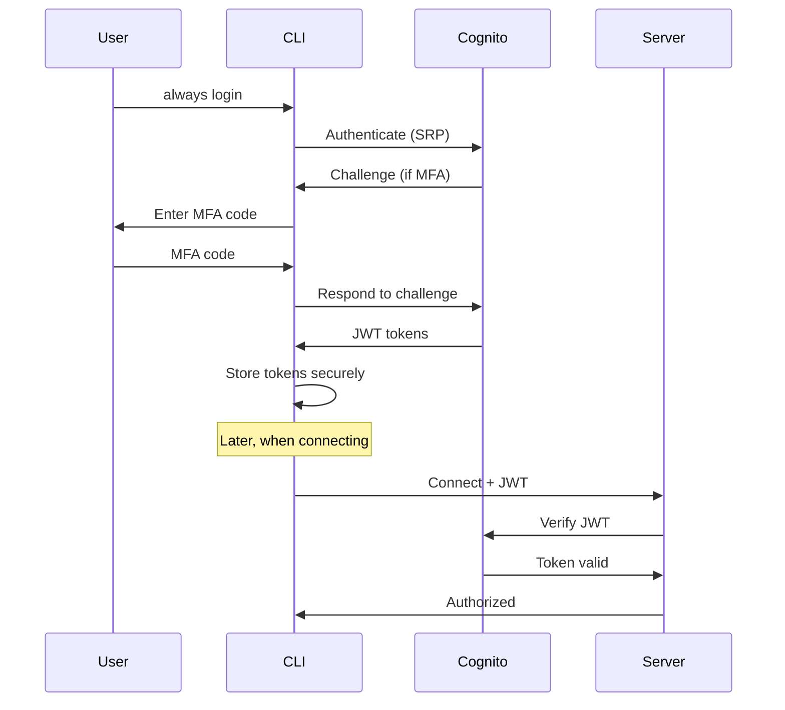

# Always Coder - Security Documentation

## Overview

Always Coder implements defense-in-depth security with multiple layers of protection. The core security principle is **zero-knowledge architecture** - the server never has access to decrypted data.

## Table of Contents

1. [Threat Model](#threat-model)
2. [Encryption](#encryption)
3. [Authentication](#authentication)
4. [Authorization](#authorization)
5. [Network Security](#network-security)
6. [Data Protection](#data-protection)
7. [Security Best Practices](#security-best-practices)
8. [Incident Response](#incident-response)
9. [Compliance](#compliance)
10. [Security Checklist](#security-checklist)

## Threat Model

### Protected Against

| Threat | Mitigation |
|--------|------------|
| **Network eavesdropping** | End-to-end encryption with XSalsa20-Poly1305 |
| **Server compromise** | Zero-knowledge architecture, server cannot decrypt |
| **Man-in-the-middle** | X25519 key exchange, TLS/WSS transport |
| **Message tampering** | Authenticated encryption (Poly1305 MAC) |
| **Replay attacks** | Random nonce per message |
| **Session hijacking** | Ephemeral keys, automatic expiry |
| **Unauthorized access** | Optional Cognito authentication |
| **Data leakage** | Encrypted at rest, automatic TTL |
| **Denial of service** | Rate limiting, CloudFront DDoS protection |

### Security Assumptions

1. **Endpoint security** - CLI and browser environments are secure
2. **QR code channel** - QR code transmission is trusted
3. **Cryptographic libraries** - TweetNaCl implementation is correct
4. **AWS infrastructure** - AWS services are secure
5. **User authentication** - Users protect their credentials

### Out of Scope

- Physical access to user devices
- Compromised user credentials
- Browser/OS vulnerabilities
- Supply chain attacks
- Quantum computing attacks (future consideration)

## Encryption

### End-to-End Encryption Architecture

```
┌──────────────┐                        ┌──────────────┐
│   CLI Client │                        │  Web Client  │
│              │                        │              │
│  ┌────────┐  │      Encrypted        │  ┌────────┐  │
│  │ Secret │  │◄───────────────────────►│  │ Secret │  │
│  │  Key   │  │    XSalsa20-Poly1305   │  │  Key   │  │
│  └────────┘  │                        │  └────────┘  │
│      ▲       │                        │      ▲       │
│      │       │                        │      │       │
│  X25519 DH   │                        │  X25519 DH   │
│      │       │                        │      │       │
│      ▼       │                        │      ▼       │
│  ┌────────┐  │                        │  ┌────────┐  │
│  │ Public │  │       Public Keys      │  │ Public │  │
│  │  Key   │──┼────────────────────────┼──│  Key   │  │
│  └────────┘  │      (via QR/Server)   │  └────────┘  │
└──────────────┘                        └──────────────┘
                           │
                           │ Encrypted
                           │ Envelopes
                           ▼
                    ┌─────────────┐
                    │   Server     │
                    │ (No Access   │
                    │ to Plaintext)│
                    └─────────────┘
```

### Cryptographic Primitives

| Component | Algorithm | Purpose | Security Level |
|-----------|-----------|---------|----------------|
| **Key Exchange** | X25519 (Curve25519) | ECDH key agreement | 128-bit |
| **Encryption** | XSalsa20 | Stream cipher | 256-bit key |
| **Authentication** | Poly1305 | MAC | 128-bit |
| **Random Numbers** | CSPRNG | Nonce generation | System RNG |

### Key Management

#### Key Generation

```typescript
// CLI generates ephemeral keypair
const keyPair = nacl.box.keyPair();
// 32-byte secret key, 32-byte public key

// Web generates ephemeral keypair
const webKeyPair = nacl.box.keyPair();

// Both sides compute shared secret
const sharedSecret = nacl.box.before(
  theirPublicKey,
  mySecretKey
);
```

#### Key Exchange Protocol

1. **CLI generates keypair** - Fresh for each session
2. **CLI publishes public key** - Via QR code
3. **Web scans QR code** - Receives CLI public key
4. **Web generates keypair** - Fresh for this connection
5. **Web sends public key** - Via WebSocket to CLI
6. **Both compute shared secret** - Using X25519 DH

#### Key Lifecycle

- **Generation**: On session creation
- **Distribution**: Via QR code (CLI→Web), WebSocket (Web→CLI)
- **Usage**: For message encryption/decryption
- **Rotation**: New keys per session
- **Destruction**: On session end or timeout

### Message Encryption

#### Encryption Process

```typescript
function encrypt(message: Message): EncryptedEnvelope {
  // 1. Generate random nonce (24 bytes)
  const nonce = nacl.randomBytes(24);

  // 2. Serialize message to JSON
  const plaintext = JSON.stringify(message);

  // 3. Encrypt with XSalsa20-Poly1305
  const ciphertext = nacl.box.after(
    plaintext,
    nonce,
    sharedSecret
  );

  // 4. Create envelope
  return {
    version: 1,
    sessionId: sessionId,
    nonce: base64(nonce),
    ciphertext: base64(ciphertext),
    timestamp: Date.now()
  };
}
```

#### Security Properties

- **Confidentiality**: XSalsa20 encryption
- **Integrity**: Poly1305 MAC prevents tampering
- **Authenticity**: Only key holder can encrypt/decrypt
- **Non-repudiation**: Not provided (ephemeral keys)
- **Forward secrecy**: Keys destroyed after session

### Perfect Forward Secrecy

Each session uses unique ephemeral keys that are never reused:

1. **Session keys are ephemeral** - Generated fresh per session
2. **No long-term keys** - Nothing to compromise
3. **Keys destroyed after use** - Cannot decrypt past sessions
4. **No key persistence** - Keys only in memory

## Authentication

### Cognito Integration (Optional)

#### User Pool Configuration

```typescript
{
  passwordPolicy: {
    minimumLength: 12,
    requireUppercase: true,
    requireLowercase: true,
    requireNumbers: true,
    requireSymbols: true
  },
  mfa: {
    enabled: true,
    type: 'TOTP'  // or 'SMS'
  },
  accountRecovery: 'email',
  advancedSecurity: {
    mode: 'ENFORCED'
  }
}
```

#### Authentication Flow



#### Token Management

```typescript
// Token storage (CLI)
interface StoredTokens {
  idToken: string;      // User identity
  accessToken: string;  // API access
  refreshToken: string; // Token refresh
  expiresAt: number;    // Expiration time
}

// Secure storage location
// ~/.always-coder/config.json (mode 0600)
```

#### JWT Verification (Server)

```typescript
async function verifyToken(token: string): Promise<Claims> {
  // 1. Decode JWT header
  const decoded = jwt.decode(token, { complete: true });

  // 2. Get signing key from Cognito JWKS
  const key = await getSigningKey(decoded.header.kid);

  // 3. Verify signature
  const verified = jwt.verify(token, key, {
    algorithms: ['RS256'],
    issuer: `https://cognito-idp.${region}.amazonaws.com/${userPoolId}`,
    audience: clientId
  });

  // 4. Check expiration
  if (verified.exp < Date.now() / 1000) {
    throw new Error('Token expired');
  }

  return verified;
}
```

### Lambda@Edge Authentication

#### CloudFront Protection

```typescript
// Lambda@Edge function
export async function handler(event: CloudFrontRequestEvent) {
  const request = event.Records[0].cf.request;
  const headers = request.headers;

  // Check for session cookie
  const cookie = parseCookie(headers.cookie);
  const sessionToken = cookie['aws-cognito-session'];

  if (!sessionToken) {
    // Redirect to Cognito hosted UI
    return {
      status: '302',
      headers: {
        location: [{
          key: 'Location',
          value: getCognitoLoginUrl(request.uri)
        }]
      }
    };
  }

  try {
    // Verify token
    await verifyToken(sessionToken);
    // Allow request to continue
    return request;
  } catch (error) {
    // Invalid token, redirect to login
    return redirectToLogin();
  }
}
```

## Authorization

### Session-Based Access Control

```typescript
// Session ownership
interface Session {
  sessionId: string;
  userId?: string;     // Owner (if authenticated)
  createdBy: string;   // Connection that created
  allowedConnections: string[]; // Authorized connections
}

// Authorization check
function canAccessSession(
  userId: string,
  session: Session
): boolean {
  // Anonymous sessions - creator only
  if (!session.userId) {
    return session.createdBy === userId;
  }

  // Authenticated sessions - owner only
  return session.userId === userId;
}
```

### Role-Based Access

```typescript
enum Role {
  CLI = 'cli',    // Can create sessions
  WEB = 'web',    // Can join sessions
  ADMIN = 'admin' // Can manage all sessions
}

// Connection authorization
interface Connection {
  connectionId: string;
  role: Role;
  userId?: string;
  sessionId?: string;
  permissions: Permission[];
}

enum Permission {
  CREATE_SESSION = 'session:create',
  JOIN_SESSION = 'session:join',
  SEND_INPUT = 'terminal:input',
  RECEIVE_OUTPUT = 'terminal:output',
  MANAGE_SESSION = 'session:manage'
}
```

## Network Security

### Transport Layer Security

All network communication uses TLS/WSS:

```typescript
// WebSocket connection (WSS)
const ws = new WebSocket('wss://api.example.com/prod');

// HTTPS for web application
const response = await fetch('https://app.example.com');
```

#### TLS Configuration

- **Minimum TLS version**: 1.2
- **Cipher suites**: ECDHE-RSA-AES128-GCM-SHA256, ECDHE-RSA-AES256-GCM-SHA384
- **Certificate validation**: Required
- **HSTS**: Enabled with max-age=31536000

### API Gateway Security

```yaml
# API Gateway configuration
WebSocketApi:
  Properties:
    RouteSelectionExpression: $request.body.action
    ApiKeySelectionExpression: $request.header.x-api-key
    DisableSchemaValidation: false

# Throttling
ThrottleSettings:
  RateLimit: 100    # Requests per second
  BurstLimit: 200   # Burst capacity

# WAF Integration
WebACL:
  Rules:
    - RateLimitRule
    - SQLInjectionRule
    - XSSRule
    - SizeRestrictionRule
```

### CloudFront Security

```typescript
// CloudFront distribution config
{
  ViewerProtocolPolicy: 'redirect-to-https',
  AllowedMethods: ['GET', 'HEAD', 'OPTIONS'],
  CacheBehaviors: {
    MinTTL: 0,
    DefaultTTL: 86400,
    MaxTTL: 31536000
  },
  CustomErrorResponses: [
    {
      ErrorCode: 403,
      ResponseCode: 404,  // Hide forbidden resources
      ResponsePagePath: '/404.html'
    }
  ],
  SecurityHeaders: {
    'Strict-Transport-Security': 'max-age=31536000; includeSubDomains',
    'X-Content-Type-Options': 'nosniff',
    'X-Frame-Options': 'DENY',
    'X-XSS-Protection': '1; mode=block',
    'Content-Security-Policy': "default-src 'self'"
  }
}
```

## Data Protection

### Data at Rest

#### DynamoDB Encryption

```typescript
// Table configuration
{
  SSESpecification: {
    SSEEnabled: true,
    SSEType: 'KMS',
    KMSMasterKeyId: 'alias/aws/dynamodb'
  },
  PointInTimeRecoverySpecification: {
    PointInTimeRecoveryEnabled: true
  }
}
```

#### S3 Encryption

```typescript
// Bucket configuration
{
  BucketEncryption: {
    ServerSideEncryptionConfiguration: [{
      ServerSideEncryptionByDefault: {
        SSEAlgorithm: 'AES256'
      }
    }]
  },
  VersioningConfiguration: {
    Status: 'Enabled'
  },
  PublicAccessBlockConfiguration: {
    BlockPublicAcls: true,
    BlockPublicPolicy: true,
    IgnorePublicAcls: true,
    RestrictPublicBuckets: true
  }
}
```

### Data in Transit

All data is encrypted in multiple layers:

1. **Application layer**: E2E encryption (XSalsa20-Poly1305)
2. **Transport layer**: TLS 1.2+ (WSS/HTTPS)
3. **Network layer**: VPC encryption (AWS internal)

### Data Retention

```typescript
// Automatic data expiration
{
  connections: {
    ttl: 24 * 60 * 60,  // 24 hours
  },
  sessions: {
    ttl: 24 * 60 * 60,  // 24 hours
  },
  messages: {
    ttl: 60 * 60,       // 1 hour
  },
  logs: {
    retention: 7,       // 7 days
  }
}
```

### Sensitive Data Handling

#### What is considered sensitive:
- Terminal I/O content
- User credentials
- Session keys
- API tokens
- Environment variables

#### Protection measures:
1. **Never logged in plaintext**
2. **Always encrypted in transit**
3. **Encrypted at rest when stored**
4. **Automatic expiration**
5. **No persistence of keys**

## Security Best Practices

### For Developers

1. **Code Security**
   - Regular dependency updates
   - Security scanning (npm audit)
   - Static analysis (ESLint security rules)
   - Secret scanning (git-secrets)

2. **Secure Coding**
   ```typescript
   // Good: Parameterized queries
   const result = await db.query(
     'SELECT * FROM sessions WHERE id = ?',
     [sessionId]
   );

   // Bad: String concatenation
   const result = await db.query(
     `SELECT * FROM sessions WHERE id = '${sessionId}'`
   );
   ```

3. **Input Validation**
   ```typescript
   // Validate all inputs
   function validateSessionId(id: string): boolean {
     return /^[A-Z0-9]{6}$/.test(id);
   }

   // Sanitize user input
   function sanitizeInput(input: string): string {
     return input.replace(/[<>]/g, '');
   }
   ```

### For Operations

1. **Infrastructure Security**
   - Enable AWS CloudTrail
   - Configure VPC Flow Logs
   - Use AWS Systems Manager
   - Enable GuardDuty

2. **Monitoring**
   ```bash
   # Monitor for suspicious activity
   aws cloudwatch put-metric-alarm \
     --alarm-name high-error-rate \
     --metric-name Errors \
     --namespace AWS/Lambda \
     --statistic Sum \
     --period 300 \
     --threshold 100 \
     --comparison-operator GreaterThanThreshold
   ```

3. **Access Control**
   - Use IAM roles, not keys
   - Enable MFA for AWS console
   - Rotate credentials regularly
   - Principle of least privilege

### For Users

1. **Secure Usage**
   - Protect QR codes from shoulder surfing
   - Use strong passwords for authentication
   - Enable MFA when available
   - Log out when finished

2. **Environment Security**
   - Keep CLI updated
   - Use secure networks
   - Avoid public WiFi
   - Verify TLS certificates

## Incident Response

### Incident Types

| Type | Severity | Response Time | Actions |
|------|----------|---------------|---------|
| **Data breach** | Critical | Immediate | Isolate, investigate, notify |
| **Account compromise** | High | 1 hour | Disable account, reset credentials |
| **DDoS attack** | High | 1 hour | Enable AWS Shield, scale resources |
| **Vulnerability discovered** | Medium | 24 hours | Patch, deploy, verify |
| **Suspicious activity** | Low | 48 hours | Investigate, monitor |

### Response Procedures

1. **Detection**
   - CloudWatch alarms
   - GuardDuty findings
   - User reports
   - Log analysis

2. **Containment**
   ```bash
   # Disable compromised account
   aws cognito-idp admin-disable-user \
     --user-pool-id us-east-1_XXXXX \
     --username compromised-user

   # Block IP address
   aws wafv2 update-ip-set \
     --name blocked-ips \
     --addresses 192.0.2.1/32
   ```

3. **Investigation**
   ```bash
   # Query CloudTrail logs
   aws cloudtrail lookup-events \
     --lookup-attributes \
       AttributeKey=Username,AttributeValue=user \
     --start-time 2024-01-01T00:00:00Z

   # Analyze DynamoDB access
   aws dynamodb describe-continuous-backups \
     --table-name Sessions
   ```

4. **Recovery**
   - Restore from backups
   - Reset credentials
   - Patch vulnerabilities
   - Update security rules

5. **Lessons Learned**
   - Document incident
   - Update procedures
   - Implement preventions
   - Train team

## Compliance

### Standards Alignment

| Standard | Compliance Level | Notes |
|----------|-----------------|-------|
| **OWASP Top 10** | Full | All risks addressed |
| **NIST Cybersecurity** | Partial | Core functions implemented |
| **SOC 2** | Ready | Controls in place |
| **GDPR** | Partial | Data protection, user rights |
| **HIPAA** | Not compliant | Not designed for PHI |

### Data Privacy

1. **Data Minimization**
   - Only collect necessary data
   - Automatic expiration
   - No analytics tracking

2. **User Rights**
   - Right to access (export data)
   - Right to deletion (account removal)
   - Right to portability (standard formats)

3. **Data Location**
   - Specify AWS region
   - No cross-region replication
   - Data residency compliance

## Security Checklist

### Deployment Checklist

- [ ] TLS certificates valid and not expiring
- [ ] WAF rules enabled
- [ ] Rate limiting configured
- [ ] CloudTrail enabled
- [ ] Backup strategy implemented
- [ ] Monitoring alerts configured
- [ ] Security groups restrictive
- [ ] IAM roles follow least privilege
- [ ] Secrets stored in AWS Secrets Manager
- [ ] Cognito MFA enabled

### Code Review Checklist

- [ ] No hardcoded secrets
- [ ] Input validation on all endpoints
- [ ] Error messages don't leak information
- [ ] SQL injection prevention
- [ ] XSS prevention
- [ ] CSRF protection
- [ ] Dependencies up to date
- [ ] Security headers configured
- [ ] Logging doesn't include sensitive data
- [ ] Tests cover security scenarios

### Operational Checklist

- [ ] Regular security updates applied
- [ ] Logs monitored for anomalies
- [ ] Backups tested regularly
- [ ] Incident response plan documented
- [ ] Team trained on security procedures
- [ ] Penetration testing performed
- [ ] Vulnerability scanning automated
- [ ] Access reviews conducted
- [ ] Compliance audits scheduled
- [ ] Security metrics tracked

## Security Contacts

- **Security Issues**: security@always-coder.dev
- **Bug Bounty**: bugbounty@always-coder.dev
- **Responsible Disclosure**: Please allow 90 days before public disclosure

## Additional Resources

- [OWASP Security Guidelines](https://owasp.org/)
- [AWS Security Best Practices](https://aws.amazon.com/security/best-practices/)
- [NIST Cybersecurity Framework](https://www.nist.gov/cyberframework)
- [TweetNaCl Security Audit](https://tweetnacl.cr.yp.to/)